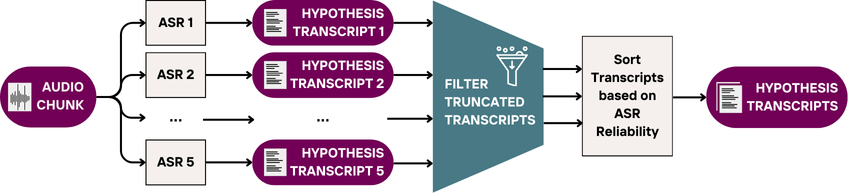
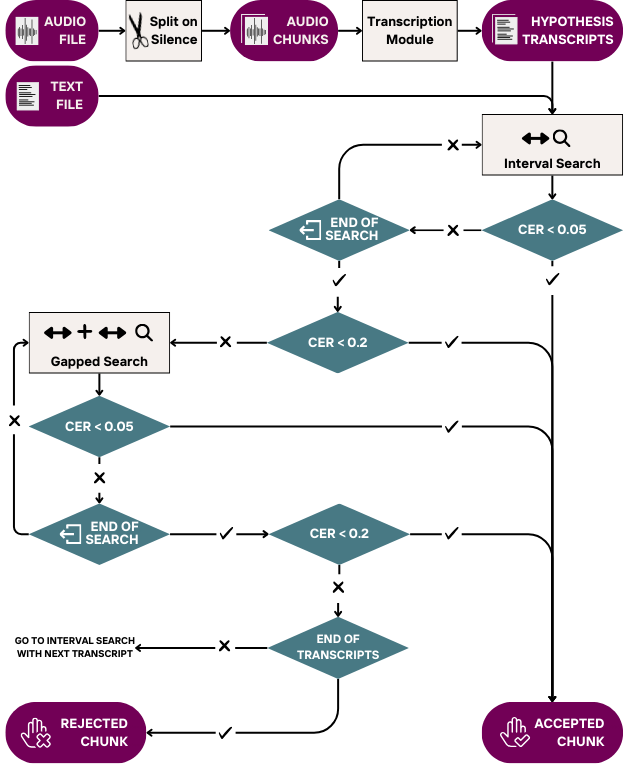

# ManaTTS Forced Aligner: Robust Forced Alignment for Low-Resource Languages

**Want to create a speech dataset, but current forced alignment tools don’t work for your setup?**

**ManaTTS Forced Aligner** is a robust, language-agnostic forced alignment module designed specifically for **low-resource languages** and imperfect audio-text matches. Unlike traditional tools like Aeneas, our method **does not require a perfect match between audio and text**. It tolerates skipped words, repetitions, or inconsistencies, using **multiple ASR models** and **character-level text similarity** with predefined thresholds.

## Why Use ManaTTS Forced Aligner?

🧠 **ASR-Agnostic and Scalable**: Use *one or more automatic speech recognition (ASR) models*, regardless of their quality.
The aligner is designed to work even with imperfect ASRs. However, **the more ASR models you provide, the more robust and accurate the alignment becomes**, thanks to majority-voting and fallback mechanisms.

🧩 **Mismatch-Tolerant**: Handles skipped or added phrases, word reorderings, and slight transcription errors.

🧪 **Flexible Scoring**: Matches based on character error rate (CER), with configurable thresholds.

🔓 **Open and Extendable**: Built in Python, licensed under MIT, and ready to adapt to your language and ASR tools.

🌍 **Proven in Practice**: Successfully used to generate **102+ hours** of aligned speech-text data for the Persian ManaTTS corpus.

---

## How It Works

The alignment process consists of two key components:

### 1. Transcription Module

* Runs multiple ASR models on each audio chunk
* Discards unreliable transcripts (e.g., truncated outputs)
* Sorts by reliability and returns top transcripts

<p align="center">
  
  <br><em>Figure: Architecture of the transcription module, showing multiple ASRs and reliability filtering.</em>
</p>

### 2. Forced Alignment

* Splits audio into 2–12 second segments based on silence
* Uses the transcription module to hypothesize possible texts
* Finds best-matching substrings in the reference text
* Accepts matches based on CER:

  * **High quality**: CER ≤ 0.05
  * **Middle quality**: 0.05 < CER ≤ 0.2
* Chunks with no acceptable match are discarded

The algorithm uses **Interval Search** first, then **Gapped Search** only if needed.

<p align="center">
  
  <br><em>Figure: Forced alignment pipeline showing silence splitting, transcription-based matching, CER thresholds, and chunk decisions.</em>
</p>

---

## Getting Started

[](https://colab.research.google.com/drive/1UPn4rdJhBevur9R7Rm6tUz3KrQSKFaoe?usp=sharing) 

You can use the forced alignment method via [Colab](https://colab.research.google.com/drive/1UPn4rdJhBevur9R7Rm6tUz3KrQSKFaoe?usp=sharing) or [the forced alignment notebook](ManaTTS-Forced-Aligner.ipynb) in this repository.

💡 To adapt it for your language, simply embed **one or more ASR models** (the more the better!) that work for your language into the transcription module section of the notebook.

---

## Supported Languages

* Actively tested on **Persian**
* Easily customizable for other low-resource languages with available ASR models

---

## License

* MIT License

---

## Citation

If you use ManaTTS Forced Aligner in your work, please cite:

```bibtex
@inproceedings{qharabagh-etal-2025-manatts,
    title = "{M}ana{TTS} {P}ersian: a recipe for creating {TTS} datasets for lower resource languages",
    author = "Qharabagh, Mahta Fetrat  and Dehghanian, Zahra  and Rabiee, Hamid R.",
    booktitle = "Proceedings of the 2025 Conference of the Nations of the Americas Chapter of the Association for Computational Linguistics: Human Language Technologies (Volume 1: Long Papers)",
    month = apr,
    year = "2025",
    address = "Albuquerque, New Mexico",
    publisher = "Association for Computational Linguistics",
    url = "https://aclanthology.org/2025.naacl-long.464/",
    pages = "9177--9206",
}
```

---

## Additional Links

* ManaTTS Dataset [Huggingface](https://huggingface.co/datasets/MahtaFetrat/Mana-TTS) | [Github](https://github.com/MahtaFetrat/ManaTTS-Persian-Speech-Dataset/)
* [Link to ManaTTS Paper](https://aclanthology.org/2025.naacl-long.464/)
